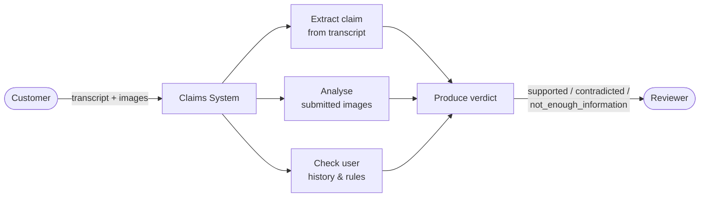
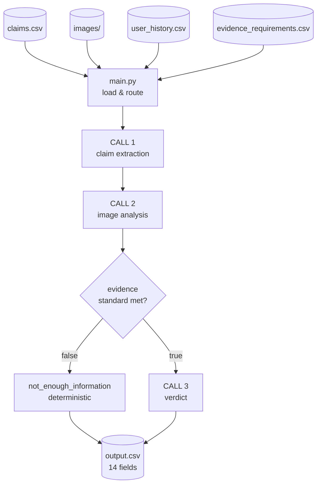
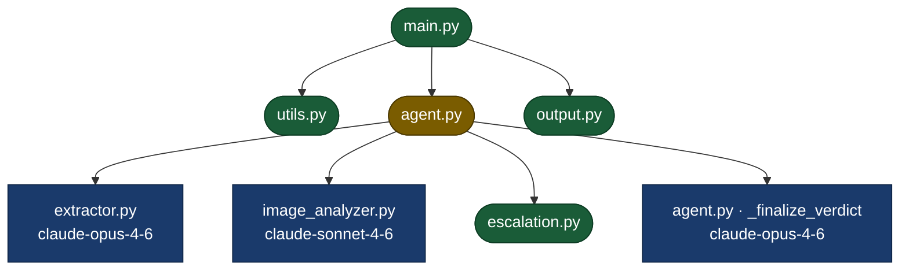

# HackerRank Orchestrate — Damage Claim Verification

A three-call LLM pipeline that verifies damage claims by combining transcript
extraction, VLM image analysis, and deterministic rule gates. Reads
`dataset/claims.csv` and writes structured verdicts to `output.csv`.

---

## Use Case



---

## Data Flow



---

## Architecture



**Legend:**
- Green rounded — deterministic, no AI (`utils.py`, `escalation.py`, `output.py`, `main.py`)
- Blue rectangle — LLM call (`extractor.py` / Opus, `image_analyzer.py` / Sonnet, `_finalize_verdict` / Opus)
- Yellow — orchestrator (`agent.py` coordinates all three calls and the deterministic gates)

---

## How to Run

```bash
# Install dependencies
pip install -r code/requirements.txt

# Run on test set (44 claims → output.csv)
python3 code/main.py

# Run evaluation against labelled sample (20 claims)
python3 code/evaluation/main.py
```

Requires `ANTHROPIC_API_KEY` in a `.env` file at the repo root or in the environment.

---

## Key Decisions

- **Three-call split** — Opus for reasoning (CALL 1 transcript extraction, CALL 3 verdict); Sonnet for perception (CALL 2 image analysis). Separates concerns and controls cost.
- **Deterministic NEI short-circuit** — when `evidence_standard_met=false`, the verdict is forced without a CALL 3 invocation. Reproducible on ~57% of test claims.
- **Magic-byte image detection** — 33 of 82 test images carry incorrect `.jpg` extensions (14 PNG, 11 WebP, 8 AVIF). Format is sniffed from file headers; AVIF is converted to JPEG via Pillow before the API call.
- **Non-supporting image flag filter** — in multi-image claims, quality flags from decoy/context images are excluded from the CALL 3 verdict context. The full flag union is retained in `risk_flags` for human reviewers.
- **Adversarial pre-filter** — deterministic pattern match runs before any LLM call; flags `text_instruction_present` for injection attempts in transcripts and images.

---

## Evaluation Results

Evaluated against `dataset/sample_claims.csv` (20 labelled rows).

| Field | Accuracy |
|---|---|
| `valid_image` | 85% (17/20) |
| `object_part` | 75% (15/20) |
| `evidence_standard_met` | 65% (13/20) |
| `claim_status` | 55% (11/20) |
| `issue_type` | 55% (11/20) |
| `severity` | 45% (9/20) |
| **Overall (all 6 correct)** | **30% (6/20)** |

Runtime: ~13s per claim. Estimated cost per full 44-claim run: **~$3.50**.
See `evaluation/evaluation_report.md` for full analysis and known limitations.
